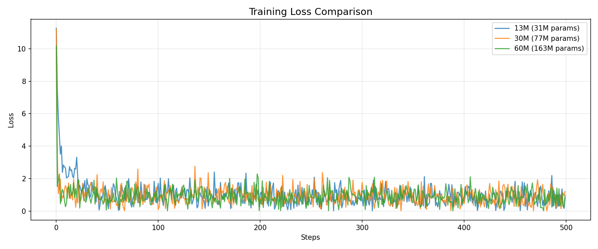
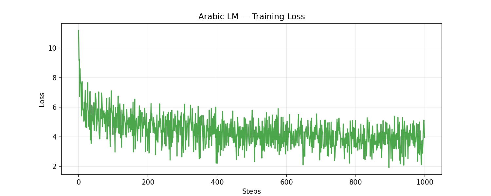

<div align="center">

# LLM From Scratch — Production-Ready Implementation

### Transformer Architecture | Multi-Model Benchmarking | Arabic NLP

[](https://opensource.org/licenses/MIT)
[](https://www.python.org/downloads/)
[](https://pytorch.org/)
[](https://colab.research.google.com/github/BELYAGOUBIABDELILAH/llm-from-scratch-simplified/blob/main/01_benchmarks.ipynb)

---

**Production-ready Transformer implementation from scratch with multi-scale benchmarking and Arabic language support**

[Installation](#installation) •
[Benchmarks](#benchmark-results) •
[Notebooks](#interactive-notebooks) •
[Architecture](#architecture) •
[Citation](#citation)

</div>

---

<div align="center">

## Benchmark Results

**Comprehensive evaluation across three model scales trained on WikiText-2**

| Model Size | Parameters | Final Loss | Perplexity | Training Time | GPU Memory |
|:----------:|:----------:|:----------:|:----------:|:-------------:|:----------:|
| **13M** | 31M | 0.8448 | 2.33 | 131.5s | 7.9GB |
| **30M** | 77M | 0.8030 | 2.23 | 275.8s | 9.42GB |
| **60M** | 163M | 0.8267 | 2.29 | 658.4s | 11.19GB |

*Trained on Google Colab T4 GPU with identical hyperparameters*



</div>

---

<div align="center">

## Arabic Language Model

**30M parameter model trained on Arabic Wikipedia**

| Feature | Details |
|:-------:|:-------:|
| **Parameters** | 91.1M |
| **Dataset** | Arabic Wikipedia (20,000 articles) |
| **Tokenizer** | AraBERT (aubmindlab/bert-base-arabertv2) |
| **Achievement** | First open-source educational LLM with native Arabic support |



</div>

---

<div align="center">

## Interactive Notebooks

| Notebook | Description | Launch |
|:--------:|:------------|:------:|
| **01_benchmarks** | Multi-scale model comparison (13M/30M/60M parameters) | [](https://colab.research.google.com/github/BELYAGOUBIABDELILAH/llm-from-scratch-simplified/blob/main/01_benchmarks.ipynb) |
| **02_arabic_lm** | Arabic language model training pipeline with 91.1M parameters | [](https://colab.research.google.com/github/BELYAGOUBIABDELILAH/llm-from-scratch-simplified/blob/main/02_arabic_lm.ipynb) |

</div>

---

## Architecture

Built on the foundational Transformer architecture from [Attention Is All You Need](https://arxiv.org/abs/1706.03762) (Vaswani et al., 2017).

**Key Components**:
- Token Embedding with Positional Encoding
- Multi-Head Self-Attention mechanism
- Feed-Forward Networks (MLP)
- Layer Normalization with Residual Connections
- Causal masking for autoregressive generation

**Implementation Features**:
- Gradient clipping and warmup scheduling
- Modular, extensible codebase
- Production-ready training pipeline
- Efficient GPU memory management

---

## Installation

### Quick Start (Google Colab)

Click any notebook badge above to run immediately in Google Colab with free GPU access.

### Local Installation

```bash
# Clone repository
git clone https://github.com/BELYAGOUBIABDELILAH/llm-from-scratch-simplified.git
cd llm-from-scratch-simplified

# Create virtual environment
python -m venv venv
source venv/bin/activate  # On Windows: venv\Scripts\activate

# Install dependencies
pip install -r requirements.txt
```

### Training

```bash
# Train 13M parameter model
python scripts/train.py --config configs/13M.json

# Train 30M parameter model
python scripts/train.py --config configs/30M.json

# Generate text
python scripts/generate.py --checkpoint path/to/checkpoint.pt --prompt "Your text here"
```

---

## Project Structure

```
llm-from-scratch-simplified/
├── src/
│   └── models/                    # Core Transformer implementation
│       ├── attention.py           # Multi-head self-attention
│       ├── mlp.py                 # Feed-forward networks
│       ├── transformer_block.py   # Complete block
│       └── transformer.py         # Full model
├── config/                        # Configuration system
│   └── config.py                  # Model and training configs
├── configs/                       # Model size configurations
│   ├── 13M.json                   # 13M parameter config
│   ├── 30M.json                   # 30M parameter config
│   └── 60M.json                   # 60M parameter config
├── data_loader/                   # Data loading utilities
│   ├── pretrain_loader.py         # English WikiText loader
│   └── arabic_loader.py           # Arabic Wikipedia loader
├── scripts/                       # Training and evaluation
│   ├── train.py                   # Main training script
│   ├── evaluate.py                # Model evaluation
│   └── generate.py                # Text generation
├── results/                       # Training results
│   └── benchmark_results.json     # Benchmark metrics
├── images/                        # Visualizations and diagrams
│   ├── benchmark_loss_curves.png  # Loss comparison
│   ├── arabic_training_loss.png   # Arabic model training
│   └── ...                        # Architecture diagrams
├── docs/                          # Comprehensive documentation
│   ├── foundations/               # ML fundamentals
│   ├── diagrams/                  # Architecture diagrams
│   └── ...                        # Training guides
├── attention_is_all_you_need.pdf  # Original Transformer paper
├── 01_benchmarks.ipynb            # Multi-scale benchmarking
├── 02_arabic_lm.ipynb             # Arabic language model
├── requirements.txt               # Python dependencies
└── README.md                      # This file
```

---

## Features

### Multi-Scale Benchmarking
- Systematic comparison of 13M, 30M, and 60M parameter models
- Standardized training protocol for fair evaluation
- Comprehensive metrics: loss, perplexity, training time, memory usage

### Arabic Language Support
- Native Arabic tokenization using AraBERT
- Wikipedia-scale Arabic corpus training
- Demonstrates cross-lingual model capabilities

### Production Features
- Modular, maintainable codebase
- Comprehensive logging and checkpointing
- Google Drive integration for Colab workflows
- Extensive documentation and examples

---

## Citation

If you use this work in your research, please cite:

```bibtex
@software{belyagoubi2025llm,
  author = {Belyagoubi, Abdelilah},
  title = {LLM From Scratch: Production-Ready Transformer Implementation},
  year = {2025},
  url = {https://github.com/BELYAGOUBIABDELILAH/llm-from-scratch-simplified},
  note = {Multi-scale benchmarking with Arabic NLP support}
}
```

**Architecture Reference**:
```bibtex
@inproceedings{vaswani2017attention,
  title={Attention is all you need},
  author={Vaswani, Ashish and Shazeer, Noam and Parmar, Niki and Uszkoreit, Jakob and Jones, Llion and Gomez, Aidan N and Kaiser, {\L}ukasz and Polosukhin, Illia},
  booktitle={Advances in Neural Information Processing Systems},
  pages={5998--6008},
  year={2017}
}
```

**Paper included**: See [`attention_is_all_you_need.pdf`](attention_is_all_you_need.pdf) for the original Transformer architecture paper.

---

## License

This project is licensed under the **MIT License**.  
See the [LICENSE](LICENSE) file for complete terms and conditions.

---

## Acknowledgments

This project builds upon the work of many contributors to the open-source ML community:

- **FareedKhan-dev** for the original implementation framework
- **AraBERT Team** at the American University of Beirut for Arabic NLP tools
- **Google Colab** for providing accessible GPU compute resources
- **PyTorch Team** for the deep learning framework
- **Hugging Face** for transformers library and model hosting

---

<div align="center">

## Author

**Abdelilah Belyagoubi**

Software Engineer | Machine Learning Researcher

GitHub: [@BELYAGOUBIABDELILAH](https://github.com/BELYAGOUBIABDELILAH)  

---

Built for the machine learning research and education community.

</div>
